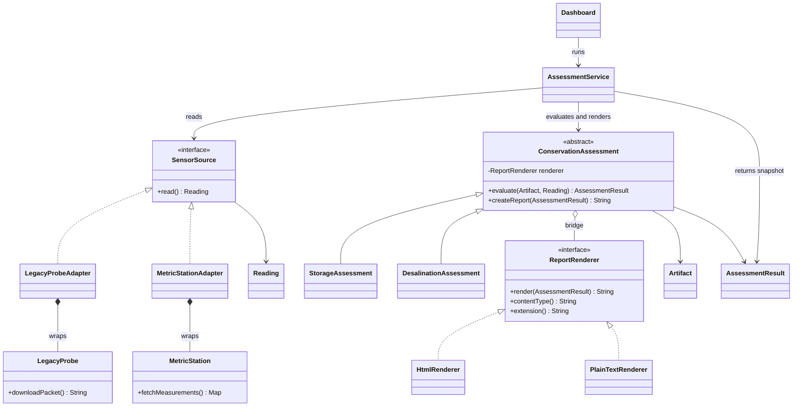

# Architecture



## Runtime example

```text
Dashboard
  -> AssessmentService.run(artifact, source, assessment)
       -> LegacyProbeAdapter.read()
            -> LegacyProbe.downloadPacket(): "68;55;0.35"
            -> Reading(20 C, 55% RH, 350 uS/cm)
       -> StorageAssessment.evaluate(artifact, reading)
            -> AssessmentResult
       -> ConservationAssessment.createReport(result)
            -> HtmlRenderer.render(result)
  -> Show normalized metrics, report, and pattern trace
```

Both patterns participate in every successful frontend assessment. Selecting another sensor changes Adapter composition; selecting another assessment or report format changes one axis of the Bridge.
